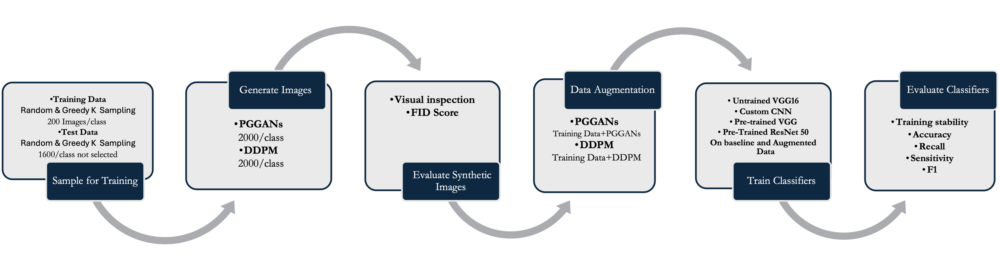
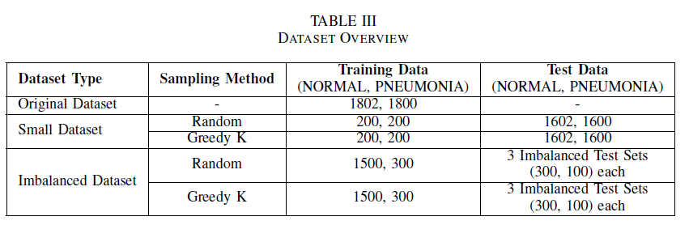
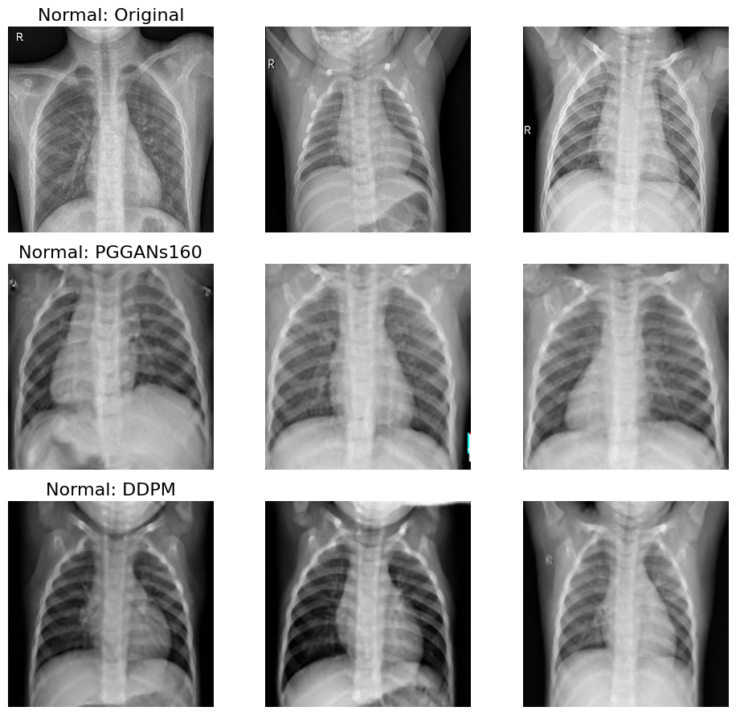
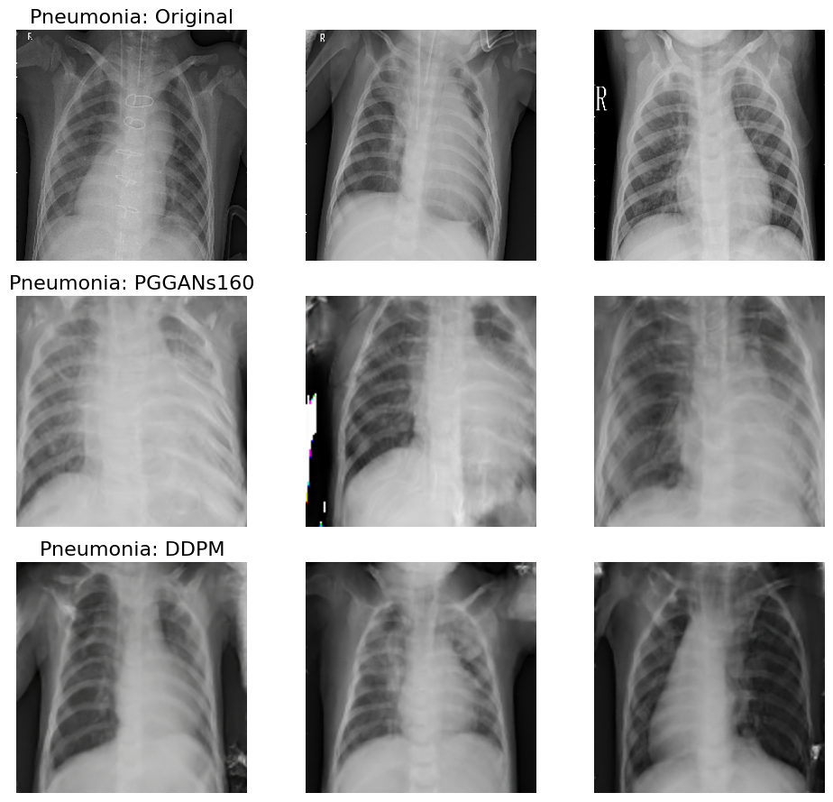

# Enhancing Accuracy and Robustness in Medical Image Classification

This repository contains the code and data used in the paper "Addressing Small and Imbalanced Medical Image Datasets Using Generative Models: A Comparative Study of DDPM and PGGANs with Random and Greedy K Sampling" by

<p align="center">
  <strong>Iman Khazrak, Shakhnoza Takhirova, Mostafa M. Rezaee, Merhdad Yadollahi, Robert C. Green II, and Shuteng Niu</strong>
</p>


## Abstract

This project addresses the challenges of small and imbalanced medical image datasets by exploring two generative models: Denoising Diffusion Probabilistic Models (DDPM) and Progressive Growing Generative Adversarial Networks (PGGANs). These models are used to generate synthetic images to augment medical datasets, which improves the performance of classification models.

We evaluate the impact of DDPM- and PGGAN-generated synthetic images on the performance of custom CNN, untrained VGG16, pretrained VGG16, and pretrained ResNet50 models, demonstrating significant improvements in model robustness and accuracy, especially in imbalanced scenarios.

For more details, please refer to the paper.

## Contributions

- **An Evaluation Framework**: A comprehensive framework to systematically evaluate and compare the quality of images produced by DDPM and PGGANs.
- **High-Quality Image Generation**: Demonstrates that producing high-quality and diverse synthetic images using small medical image datasets is feasible.
- **Accuracy Improvement**: Incorporating synthetic images into the training datasets significantly improves the accuracy of classification models.
- **Increased Robustness**: Adding synthetic images to the original datasets enhances the robustness of classification models.
- **Faster Convergence**: The inclusion of synthetic images accelerates the convergence of classification models.

## Contents

- `VGG128_all_models.ipynb`: Jupyter notebook for training and evaluating the VGG16 model.
- `CNN_Classifier.ipynb`: Jupyter notebook for training and evaluating the custom CNN model.
- `DDPM_Pytorch.ipynb`: Jupyter notebook for training and evaluating DDPM.
- `progan_modules.py`: Module definitions for PGGANs.
- `fid_plot.ipynb`: Jupyter notebook for calculating and plotting FID scores.
- `requirements.txt`: List of required Python packages.
- `environment.yml`: Conda environment configuration file.

## Project Structure

```sh
.
├── Code
│   ├── Classification Models
│   │   ├── Classification_128input
│   │   └── Classification_224input
│   ├── DDPM
│   │   └── DDPM_Pytorch.ipynb
│   ├── FID
│   │   ├── Results.txt
│   │   ├── fid.sh
│   │   ├── fid_comparison_plot.png
│   │   ├── fid_comparison_plot_full.png
│   │   └── fid_plot.ipynb
│   └── PGGANs
│       ├── ModelTrainingImages
│       ├── progan_modules.py
│       ├── train.py
│       ├── train_config_NRM200k_2024-04-11_20_17.txt
│       ├── train_config_PNM200k_2024-04-11_21_23.txt
│       ├── train_log_NRM200k_2024-04-11_20_17.txt
│       └── train_log_PNM200k_2024-04-11_21_23.txt
├── Dataset
│   ├── All_Data
│   │   ├── NORMAL
│   │   └── PNEUMONIA
│   ├── Generated_Images
│   │   ├── DDPM
│   │   ├── PGGANs
│   │   └── cGANs
│   ├── Mixed_Data
│   │   ├── Mixed150
│   │   └── PGGANs
│   └── Train
│       ├── NORMAL
│       └── PNEUMONIA
├── img
│   ├── DDPM_forward.png
│   ├── FID.png
│   ├── Normal_vs_Original_ddpm_3images.png
│   ├── Pneumonia_Original_ddpm_gans_3images.png
│   └── VGG16_and_CNN_performance_5 runs_2.png
├── requirements.txt
├── environment.yml
├── README.md
├── LICENSE

```

## Setup

### Prerequisites

- Python 3.x
- Conda or virtualenv

### Installation

1. Clone this repository:
    ```bash
    git clone https://github.com/yourusername/medical-image-classification.git
    cd medical-image-classification
    ```

2. Install the required packages using `requirements.txt`:
    ```bash
    pip install -r requirements.txt
    ```

3. Alternatively, create a conda environment using `environment.yml`:
    ```bash
    conda env create -f environment.yml
    conda activate your-environment-name
    ```

## Methodology


## Dataset

The dataset used in this study consists of Chest X-ray (CXR) images with two classes: NORMAL and PNEUMONIA. The dataset is structured as follows:
- `dataset/NORMAL`: Contains normal CXR images.
- `dataset/PNEUMONIA`: Contains pneumonia CXR images.





## Running the Code

### Training the VGG16 Model

1. Prepare the dataset:
    ```python
    from VGG_help import prepare_dataset
    dataset_dir = 'path/to/dataset'
    class_labels = ['NORMAL', 'PNEUMONIA']
    X, y = prepare_dataset(dataset_dir, class_labels)
    ```

2. Train the VGG16 model using cross-validation:
    ```python
    from VGG_help import cv_train_vgg_model
    fold_metrics_df, best_model = cv_train_vgg_model(X, y)
    ```

3. Plot training history:
    ```python
    from VGG_help import plot_train_history
    plot_train_history(fold_metrics_df, 'VGG16 Training History', 'vgg16_training_history.png')
    ```

### Training the Custom CNN Model

1. Load the dataset and prepare it as shown in the VGG16 training section.

2. Train the custom CNN model using cross-validation:
    ```python
    from CNN_Classification import fit_classification_model_cv
    fold_metrics_df, best_model = fit_classification_model_cv(X, y)
    ```

### Training DDPM

1. Open the `DDPM_Pytorch.ipynb` notebook.
2. Follow the instructions to train and evaluate the DDPM model.

### Training PGGANs

1. Train the PGGAN model using the `train.py` script:
    ```bash
    python train.py --path path/to/dataset --trial_name trial1 --gpu_id 0
    ```

<p align="center">
  
  
</p>


### Calculating FID Scores

1. Open the `fid_plot.ipynb` notebook.
2. Follow the instructions to calculate and plot the FID scores.

.png)

## Results

The results from the cross-validation and test set evaluations will provide insights into the performance improvements achieved by using synthetic images generated by DDPM and PGGANs.


## Contact

For any questions or issues, please contact:

- Imran Khazrak: ikhazra@bgsu.edu
- Shakhnoza Takhirova: takhirs@bgsu.edu
- Mostafa M. Rezaee: mostam@bgsu.edu
- Merhdad Yadollahi: mehrday@bgsu.edu
- Robert C. Green II: greenr@bgsu.edu
- Shuteng Niu: sniu@bgsu.edu

## License

This project is licensed under the MIT License.
